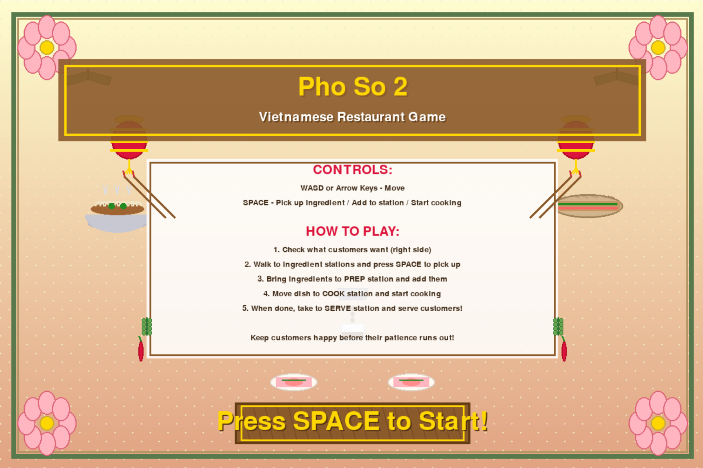
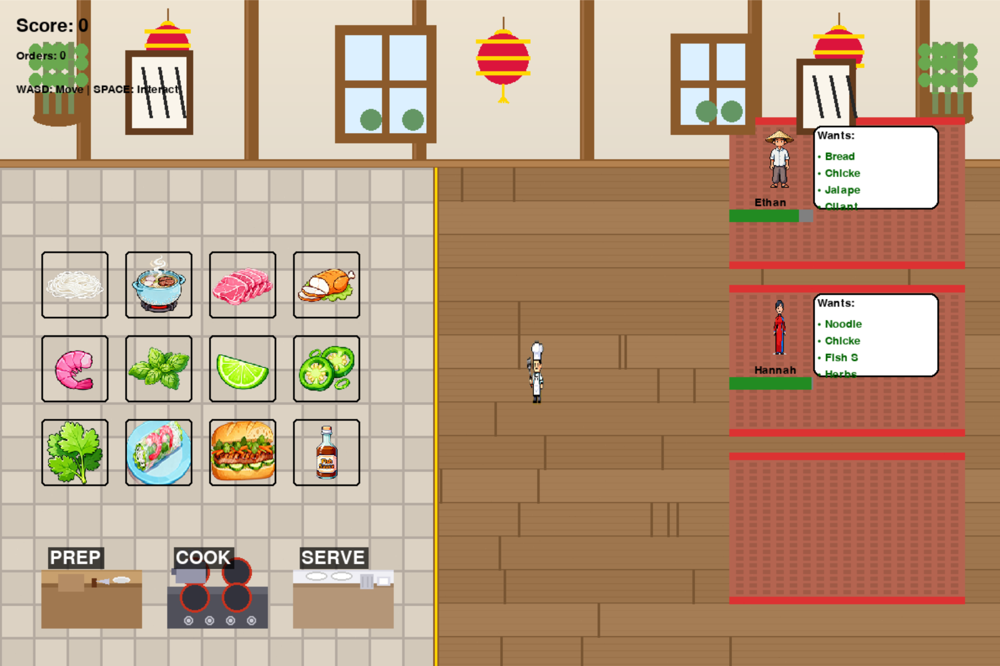

# Pho So 2

A Vietnamese restaurant simulation game built using Python and Pygame.

## Details

### Overview
Pho So 2 models the fast-paced environment of a Vietnamese kitchen, requiring the player to manage ingredients, cooking stations, timing, and customer queues. It demonstrates real-time decision-making, state management, and resource handling within a game environment.

### Libraries
- Pygame for rendering, sprite handling, event loops, and collision detection
- Pillow (PIL) for image processing and asset manipulation

### Future Improvements
- Implement more dishes and customer personality types
- Add sound effects and background music variations
- Introduce difficulty levels
- Improve the UI with animated transitions
- Add save/load system and performance analytics

## Development Notes
- Created for KSA x Claude Vibe-a-thon
- Used LLM assistance (Claude AI) for debugging and code generation

## Screenshots

 

## Set Up Instructions

### Requirements
- Install Python 3.x from: [https://python.org](https://python.org/)

### Install Dependencies
- pip install pygame
- pip install Pillow

### Run the Game
- python viet_restaurant.py

## Collaborators
- Lawson Pham (GitHub: @lawsonpham)
- Ryan Fang (GitHub: @Brustachio)
- Albert Yorn (GitHub: @albrtyrn)
- An Tiet (GitHub: @kwaaz1)